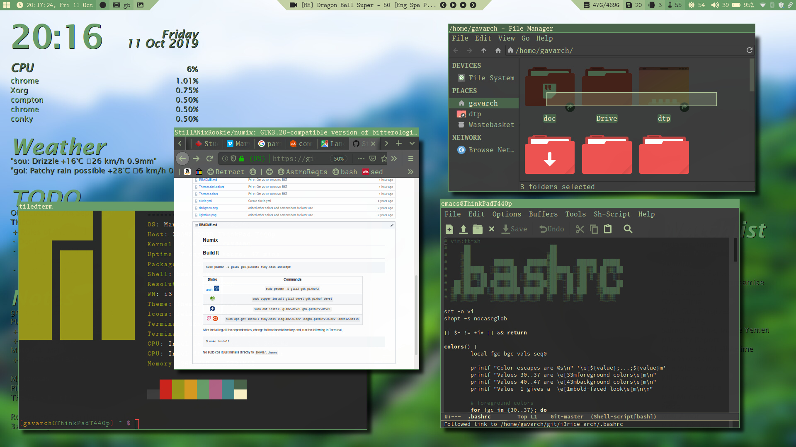
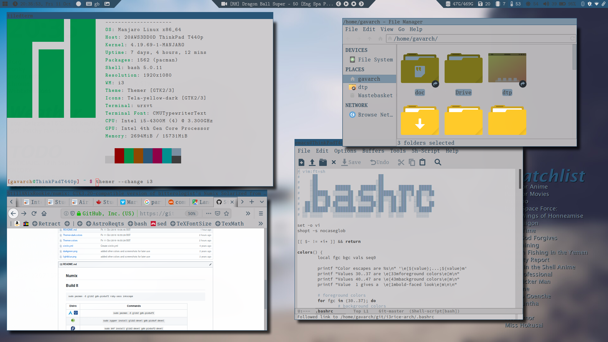
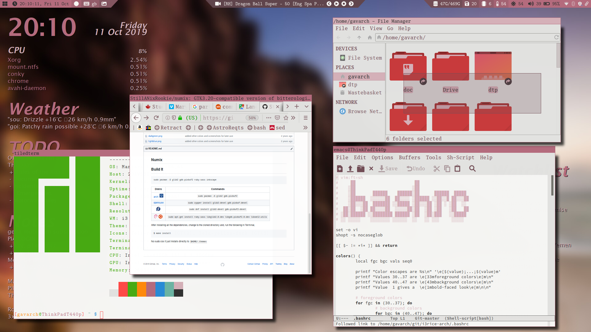
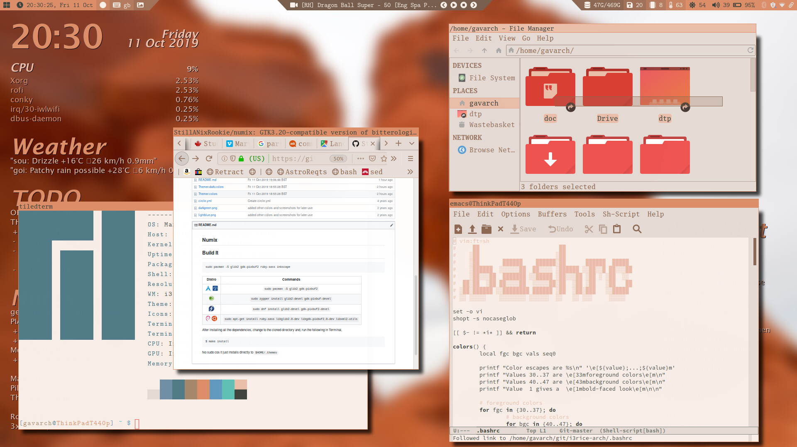
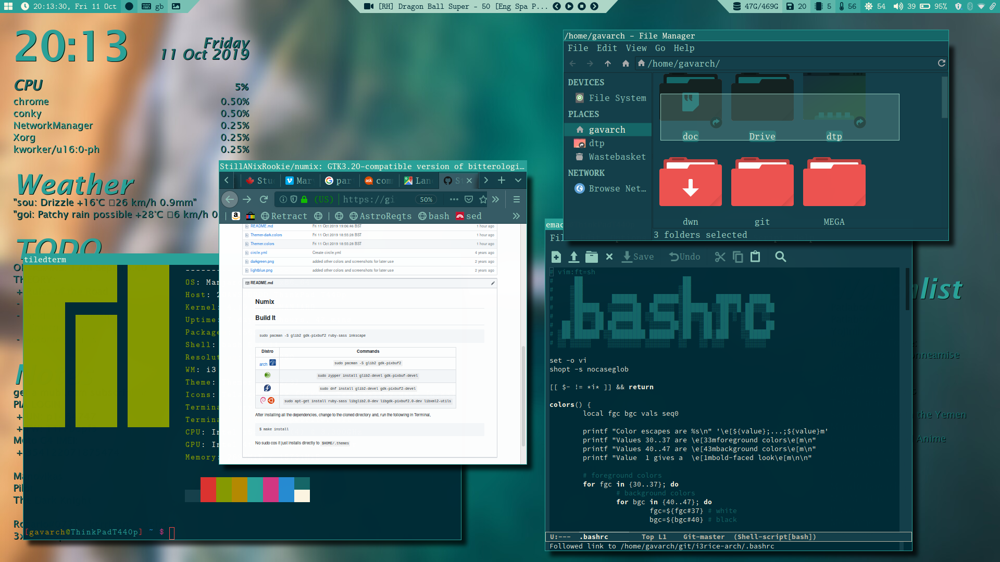
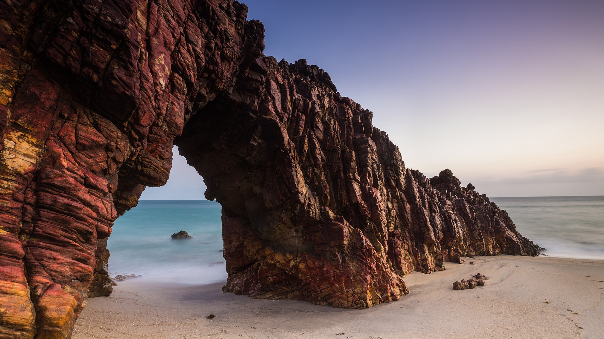
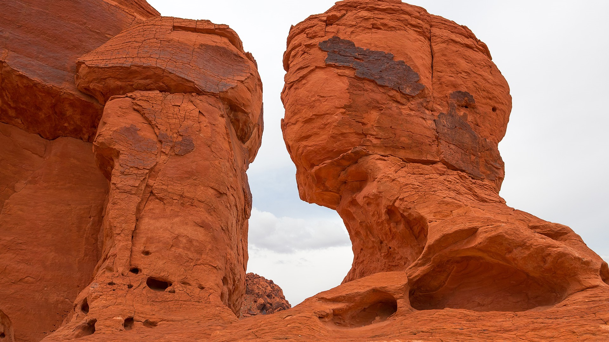

# numix
## Build It

```
sudo pacman -S glib2 gdk-pixbuf2 ruby-sass inkscape
```

|Distro                                   | Commands                                          |
|:----:                                   | :----:                                            |
|![arch][arch] &nbsp;![antergos][antergos]| `sudo pacman -S glib2 gdk-pixbuf2`                |
|![opensuse][opensuse]                    | `sudo zypper install glib2-devel gdk-pixbuf-devel`|
|![fedora][fedora]                        | `sudo dnf install glib2-devel gdk-pixbuf2-devel`  |
|![debian][debian] &nbsp;![ubuntu][ubuntu]| `sudo apt-get install ruby-sass libglib2.0-dev libgdk-pixbuf2.0-dev libxml2-utils`|

After installing all the dependencies, change to the cloned directory and, run the following in Terminal,

```sh
$ make install
```

No `sudo` needed cos it just installs directly to `$HOME/.themes/Themer`

## scrots & walls
















[antergos]: https://antergos.com/distro-logos/logo-square26x26.png "antergos"
[arch]: https://antergos.com/distro-logos/archlogo26x26.png "arch"
[fedora]: https://antergos.com/distro-logos/fedora-logo.png "fedora"
[openSUSE]: https://antergos.com/distro-logos/Geeko-button-bling7.png "openSUSE"
[ubuntu]: https://antergos.com/distro-logos/ubuntu_orange_hex.png "ubuntu"
[debian]: https://antergos.com/distro-logos/openlogo-nd-25.png "debian"
